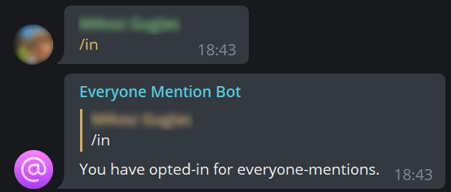
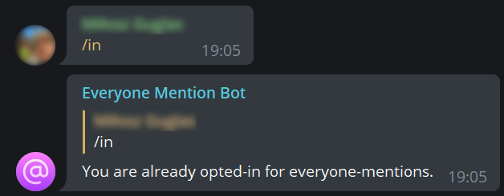
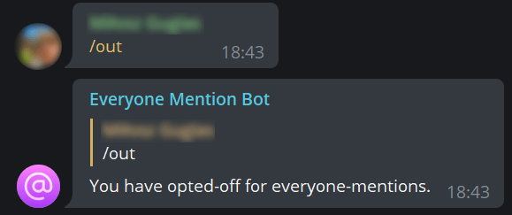
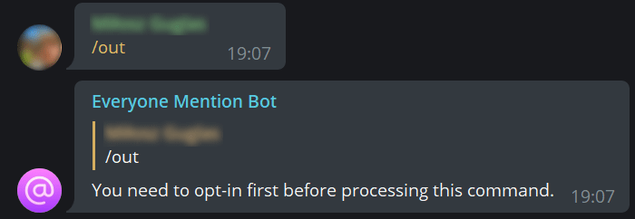
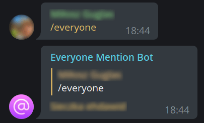
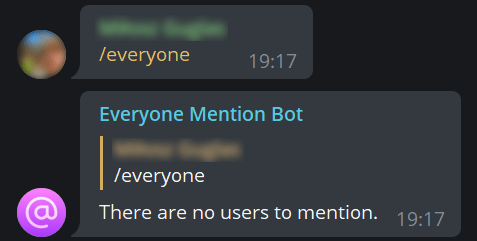

# <p align="center"> [everyone-mention-telegram-bot](http://t.me/everyone_mention_bot)
<p align="center"> 
<p align="center"> simple, but useful telegram bot to gather all of group members attention!
<!-- Icon made by https://www.freepik.com from https://www.flaticon.com/ -->

# Contents

* [Getting started.](#getting-started)
    * [Requirements](#requirements)
    * [Installation](#installation)
    * [Logs](#logs)
    * [Env files](#env-files)
* [Commands](#commands)
    * [`/in`](#in)
    * [`/out`](#out)
    * [`/everyone`](#everyone)

## Getting started

### Requirements
- `docker-compose` in version `1.25.0`
- `docker` in version `20.10.7`

### Installation
```bash
git clone https://github.com/miloszowi/everyone-mention-telegram-bot.git
```
after that, you need to copy env files and fulfill it with correct values
```bash
cp docker/config/app.dist.env docker/config/app.env
cp docker/config/database.dist.env docker/config/app.env
```
and finally, you can run the bot by launching docker containers
```bash
docker-compose up -d
```
(`-d` flag will run containers in detached mode)
### Logs
You can use
```bash
docker/logs <container>
```
to check container logs
### Env files
app.env
- `BOT_TOKEN` - your telegram bot token from [BotFather](https://telegram.me/BotFather)
- `MONGODB_DATABASE` - MongoDB database name
- `MONGODB_USERNAME` - MongoDB username
- `MONGODB_PASSWORD` - MongoDB password
- `MONGODB_HOSTNAME` - MongoDB host (default `database` - container name)
- `MONGODB_PORT` - MongoDB port (default `27017` - given in docker-compose configuration)

database.env
- `MONGO_INITDB_ROOT_USERNAME` - conf from `app.env`
- `MONGO_INITDB_ROOT_PASSWORD` - conf from `app.env`
- `MONGO_INITDB_DATABASE` - conf from `app.env`
- `MONGODB_DATA_DIR` - directory to store MongoDB documents (inside a container)
- `MONDODB_LOG_DIR` - path to logs storage 
## Commands
### `/in`
Will sign you in for everyone-mentions.



If you have already opted-in before, alternative reply will be displayed.



### `/out`
Will sign you off for everyone-mentions.



If you haven't opted-in before, alternative reply will be displayed.



### `/everyone`
You can also type 
```
/everyone silent
```
to list users that opted-in for everyone-mentions but without tagging them.
Will mention everyone that opted-in for everyone-mentions separated by spaces.

If user does not have nickname, it will first try to assign his firstname, then random firstname from `names` python library



If there are no users that opted-in for mentioning, alternative reply will be displayed.


