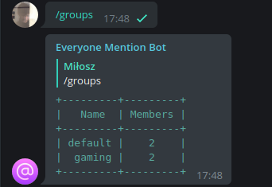

# <p align="center"> [everyone-mention-telegram-bot](http://t.me/everyone_mention_bot)
<p align="center"> 
<!-- Icon made by https://www.freepik.com from https://www.flaticon.com/ -->

# Contents

* [Description](#description)
* [Getting started.](#getting-started)
    * [Requirements](#requirements)
    * [Installation](#installation)
    * [Logs](#logs)
    * [Env files](#env-files)
* [Commands](#commands)
    * [`/join`](#join)
    * [`/leave`](#leave)
    * [`/everyone`](#everyone)
    * [`/groups`](#groups)
    * [`/start`](#start)
## Description
Everyone Mention Bot is simple, but useful telegram bot to gather group members attention.

You can create groups per chat to mention every user that joined the group by calling one command instead of mentioning them one by one.

## Getting started
### Requirements
- `docker-compose` in version `1.25.0`
- `docker` in version `20.10.7`

### Installation
- copy the repository 
```bash
git clone https://github.com/miloszowi/everyone-mention-telegram-bot.git
```
- copy environment files and fulfill empty values
```bash
cp .env.local .env
cp docker/config/app.dist.env docker/config/app.env
cp docker/config/database.dist.env docker/config/app.env
```
- start the project (`-d` flag will run containers in detached mode)
```bash
docker-compose up -d
```
### Logs
```bash
docker/logs <container>
```
### Env files
- `.env`
  - `MONGODB_INTERNAL_PORT` - Mongodb internal port (should be the same as declared in `app.env`)
  - `APP_INTERNAL_PORT` - App internal port (should be the same as declared in `app.env`)
  - `APP_EXPOSED_PORT` - App exposed port (if you are not using any reverse proxy it should be also the same as declared in `app.env`)


- `app.env`
  - `BOT_TOKEN` - your telegram bot token from [BotFather](https://telegram.me/BotFather)
  - `WEBHOOK_URL` - url for telegram webhooks (withour the bot token)
  - `PORT` - port used for initializing webhook & app
  - `MONGODB_DATABASE` - MongoDB database name
  - `MONGODB_USERNAME` - MongoDB username
  - `MONGODB_PASSWORD` - MongoDB password
  - `MONGODB_HOSTNAME` - MongoDB host (default `database` - container name)
  - `MONGODB_PORT` - MongoDB port (default `27017` - given in docker-compose configuration)
  - `BANNED_USERS` - user ids separated by comma that are not allowed to use the bot

- `database.env`
  - `MONGO_INITDB_ROOT_USERNAME` - conf from `app.env`
  - `MONGO_INITDB_ROOT_PASSWORD` - conf from `app.env`
  - `MONGO_INITDB_DATABASE` - conf from `app.env`
  - `MONGODB_DATA_DIR` - directory to store MongoDB documents (inside a container)
  - `MONDODB_LOG_DIR` - path to logs storage 
## Commands
### `/join`
```
/join <group_name>
```
Joins the group (and create if it did not exist before) given in message (`default` if not given)


### `/leave`
```
/leave <group_name>
```

Leaves the group given in message (`default` if not given)


### `/everyone`
```
/everyone <group_id>
```
Will mention every member of given group (`default` if not given).

If user does not have nickname, it will first try to assign his firstname, then random firstname from `names` python library


### `/groups`
Will display available groups for this chat as well with members count.


### `/start`
Start & Help message


