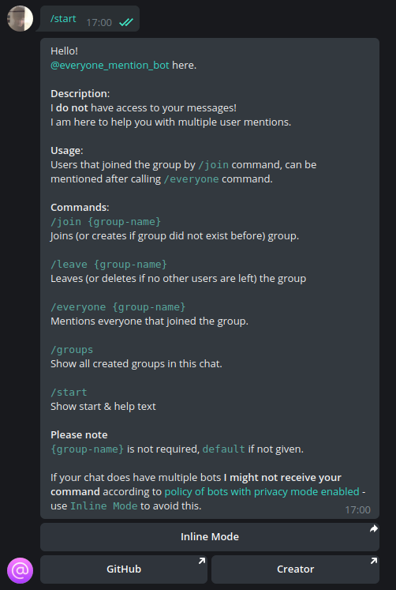

# <p align="center"> [everyone-mention-telegram-bot](http://t.me/everyone_mention_bot)
<p align="center"> 
<!-- Icon made by https://www.freepik.com from https://www.flaticon.com/ -->

# Contents

* [Description](#description)
* [Commands](#commands)
    * [`/join`](#join)
    * [`/leave`](#leave)
    * [`/everyone`](#everyone)
    * [`/groups`](#groups)
    * [`/start`](#start)
    * [Example command flow](#example-command-flow)
* [Inline Mode](#inline-mode)
    * [Usage](#usage)
* [Getting started.](#getting-started)
    * [Requirements](#requirements)
    * [Installation](#installation)
    * [Logs](#logs)
    * [Env files](#env-files)
## Description
Everyone Mention Bot is simple, but useful telegram bot to gather group members attention.

You can create groups per chat to mention every user that joined the group by calling one command instead of mentioning them one by one.

## Commands
*Important*: `{group-name}` is not required, if not given, it will be set to `default`.
### `/join`
Joins the group (if group did not exist before, it will be created).
```
/join {group_name}
```
*Examples*

without group name


with group name


### `/leave`
Leaves the group (and deletes if no members are left).
```
/leave {group_name}
```
*Examples*

without group name


with group name


### `/everyone`
Mention everyone that joined requested group.
```
/everyone {group-name}
```

*Examples*

without group name


with group name


### `/groups`
Will display available groups for this chat as well with members count.


### `/start`
Start & Help message



### Example command flow


## Inline Mode
Using Inline Mode is recommended because policy of bots with privacy mode enabled (https://core.telegram.org/bots/faq#what-messages-will-my-bot-get) says that command trigger is sent (without mentioning the bot) only to the last mentioned bot. So if you do have multiple bots in current chat, I might not receive your command!

### Usage
To use inline mode, type `@everyone_mention_bot` in telegram message input or click on the `Inline Mode` button from `/start` command.


Type in your group name (you can leave it blank for `default` group name), then click on one of the three following options.


## Getting started
### Requirements
- `docker-compose` in version `1.25.0`
- `docker` in version `20.10.7`

### Installation
- copy the repository 
```bash
git clone https://github.com/miloszowi/everyone-mention-telegram-bot.git
```
- copy environment files and fulfill empty values
```bash
cp .env.local .env
cp docker/config/app.env.local docker/config/app.env
cp docker/config/database.env.local docker/config/app.env
```
- start the project (`-d` flag will run containers in detached mode)
```bash
docker-compose up -d
```
### Logs
```bash
docker/logs <container>
```
### Env files
- `.env`
  - `MONGODB_INTERNAL_PORT` - Mongodb internal port (should be the same as declared in `app.env`)
  - `APP_INTERNAL_PORT` - App internal port (should be the same as declared in `app.env`)
  - `APP_EXPOSED_PORT` - App exposed port (if you are not using any reverse proxy it should be also the same as declared in `app.env`)


- `app.env`
  - `BOT_TOKEN` - your telegram bot token from [BotFather](https://telegram.me/BotFather)
  - `WEBHOOK_URL` - url for telegram webhooks (withour the bot token)
  - `PORT` - port used for initializing webhook & app
  - `MONGODB_DATABASE` - MongoDB database name
  - `MONGODB_USERNAME` - MongoDB username
  - `MONGODB_PASSWORD` - MongoDB password
  - `MONGODB_HOSTNAME` - MongoDB host (default `database` - container name)
  - `MONGODB_PORT` - MongoDB port (default `27017` - given in docker-compose configuration)
  - `BANNED_USERS` - user ids separated by comma that are not allowed to use the bot

- `database.env`
  - `MONGO_INITDB_ROOT_USERNAME` - conf from `app.env`
  - `MONGO_INITDB_ROOT_PASSWORD` - conf from `app.env`
  - `MONGO_INITDB_DATABASE` - conf from `app.env`
  - `MONGODB_DATA_DIR` - directory to store MongoDB documents (inside a container)
  - `MONDODB_LOG_DIR` - path to logs storage 